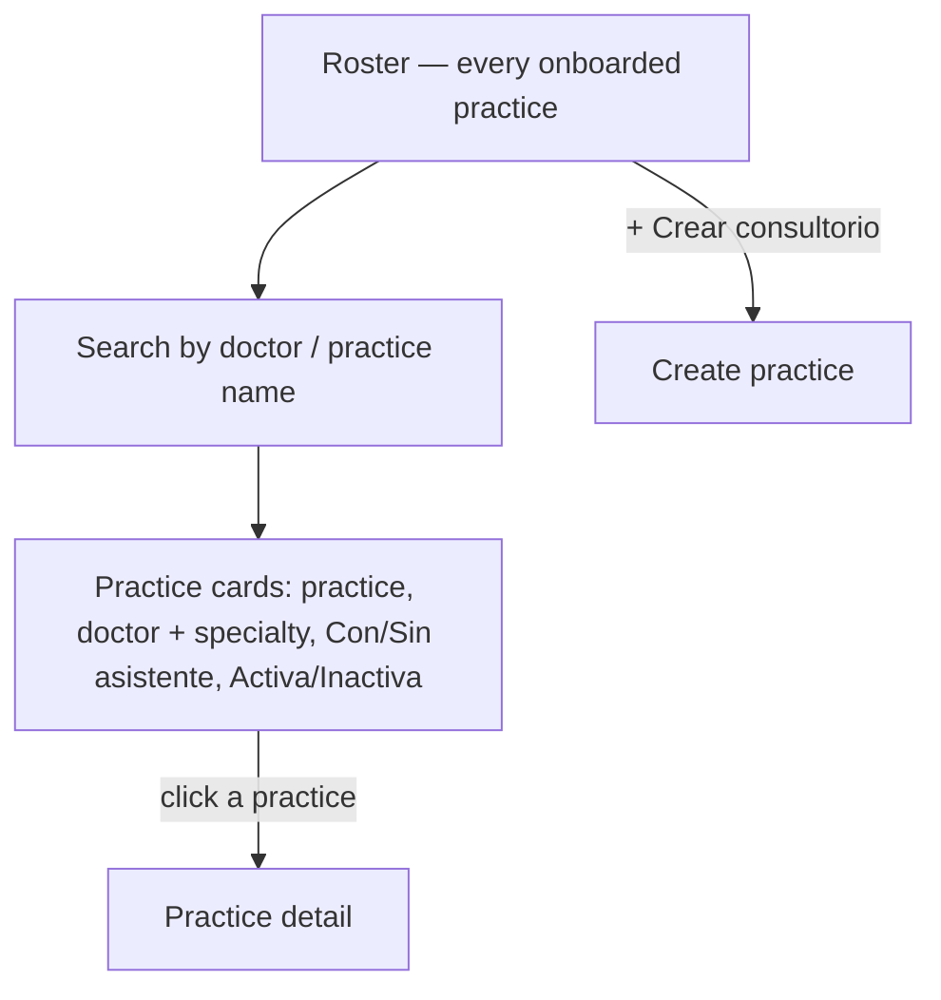
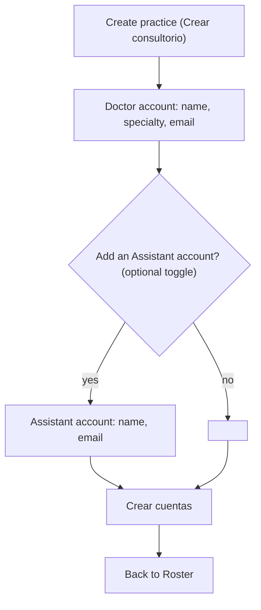
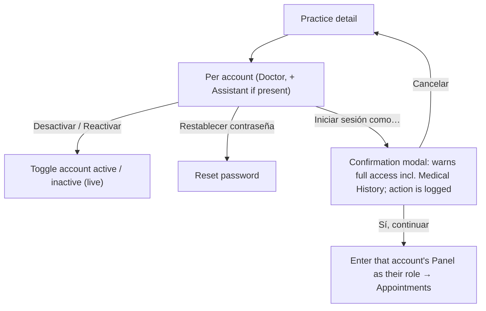
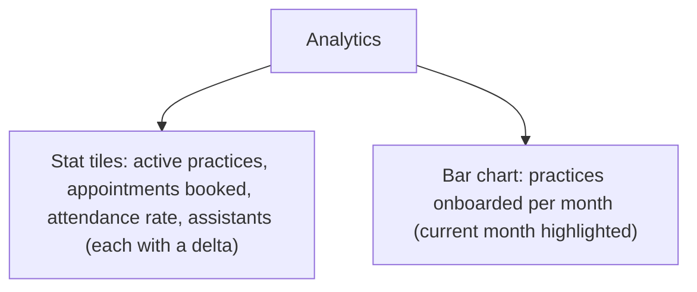
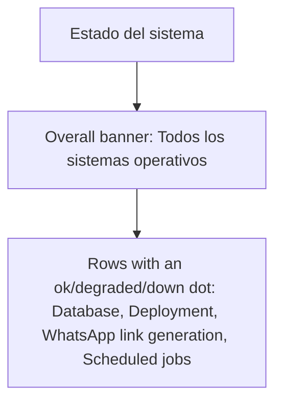

# Admin — flows

The founder's own internal surface, visually distinct from the patient site and the
panel. Never a role a Doctor or Assistant has (`CONTEXT.md`: Admin). It provisions
accounts (the concierge model, [ADR-0005](../adr/0005-concierge-doctor-onboarding.md),
[ADR-0013](../adr/0013-assistant-accounts-founder-provisioned.md)) and provides support
tooling. Nav: **Roster · Analytics · Estado del sistema**.

## 1. Roster → detail

Each row shows a status dot (green = active / terracotta = inactive) and whether a
Assistant account exists. On mobile the row wraps into a stacked card.

## 2. Create practice

Provisions **bare concierge accounts** — the Doctor completes their own Onboarding
afterwards ([ADR-0005](../adr/0005-concierge-doctor-onboarding.md)).

A practice typically gets its Doctor and Assistant logins provisioned together
([ADR-0013](../adr/0013-assistant-accounts-founder-provisioned.md)).

## 3. Practice detail — deactivate, reset, impersonate

Impersonation is a deliberate two-step with a confirmation modal. It grants **full
access, including Medical History** — a founder-level exception to the per-Doctor
siloing guarantee ([ADR-0014](../adr/0014-admin-impersonation-full-access.md), which
relaxes [ADR-0011](../adr/0011-medical-history-siloed-per-doctor.md)). This flow crosses
surfaces: confirming drops the founder **into that account's panel**.

> Deactivating a practice's accounts blocks their panel login; a `CONTEXT.md`-level
> action distinct from deleting anything.

## 4. Analytics (read-only)

Business metrics on the dashboard stat-grid pattern, scaled up.

No actions here — it is a view. Wire the tiles/chart to real platform data.

## 5. System status (read-only)

Technical health, reusing the availability-dot language (green ok / terracotta degraded
/ red down).

---

**Sources**: `CONTEXT.md` (Admin, Assistant, Subscription); ADRs
[0005](../adr/0005-concierge-doctor-onboarding.md),
[0011](../adr/0011-medical-history-siloed-per-doctor.md),
[0013](../adr/0013-assistant-accounts-founder-provisioned.md),
[0014](../adr/0014-admin-impersonation-full-access.md); prototype
`design/Alivia Panel Prototype.dc.html` (Admin surface).
