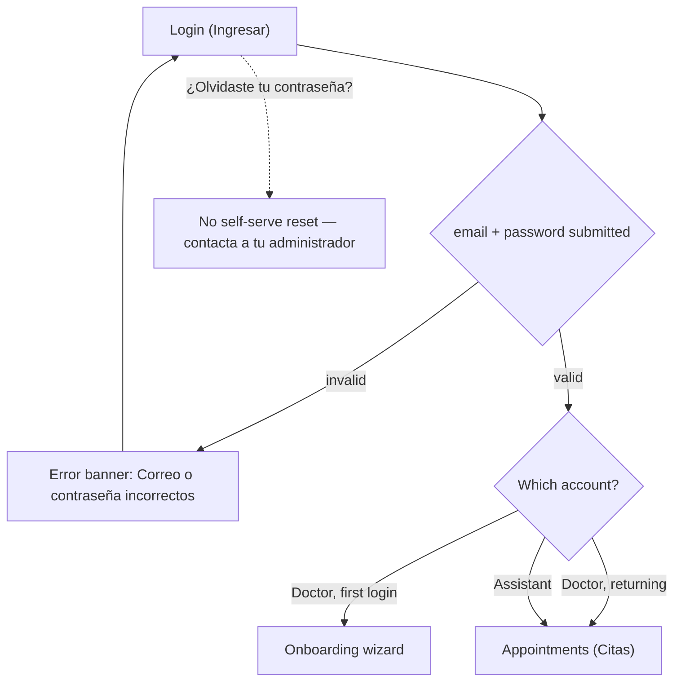
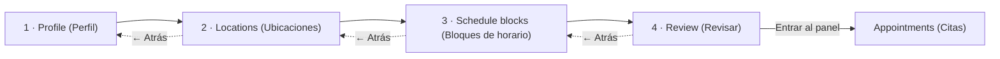
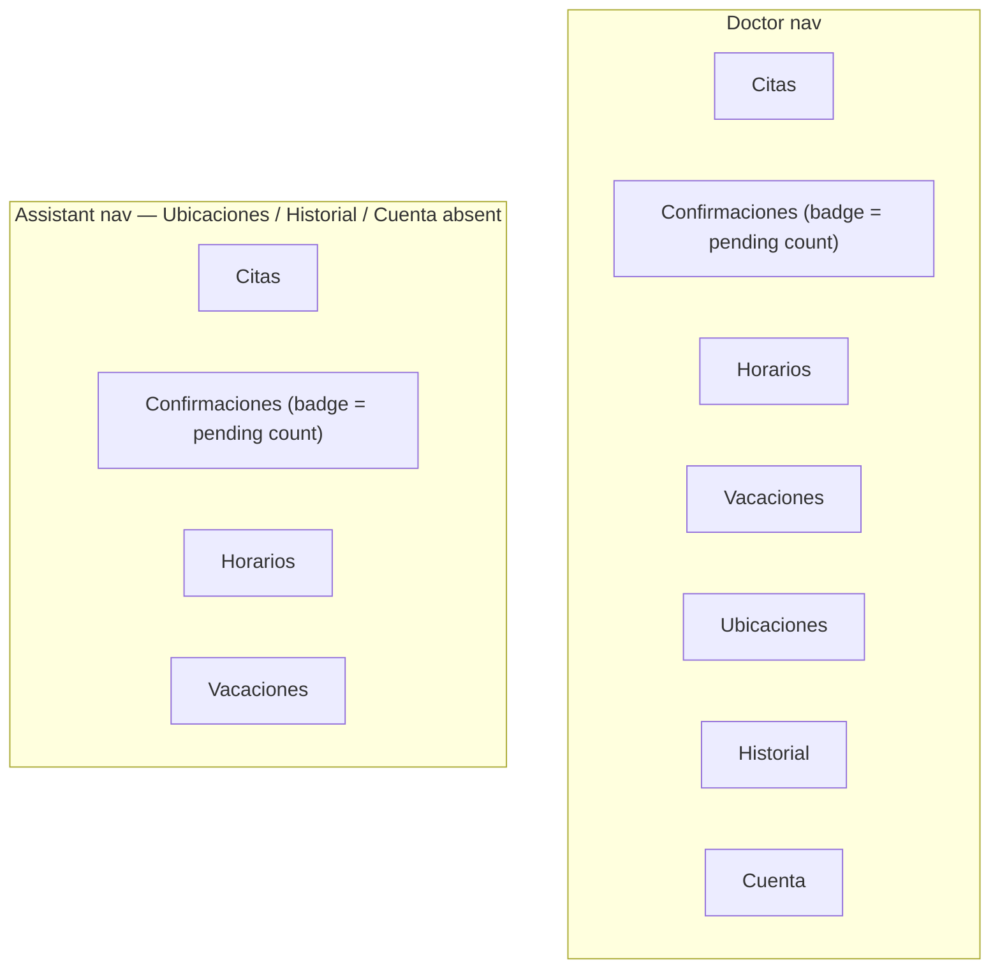
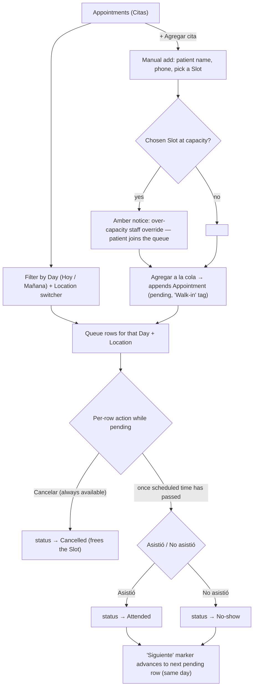
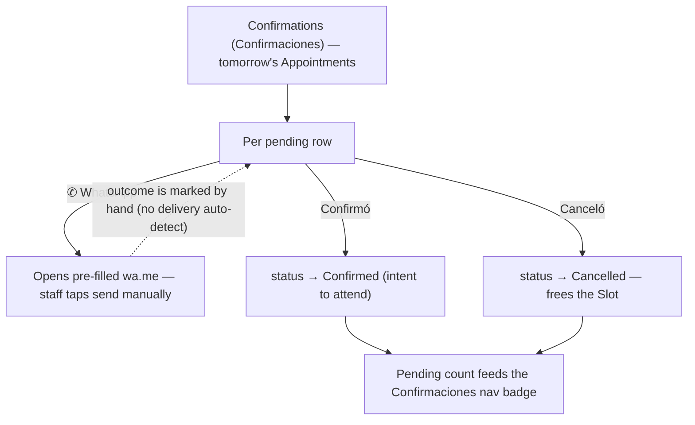
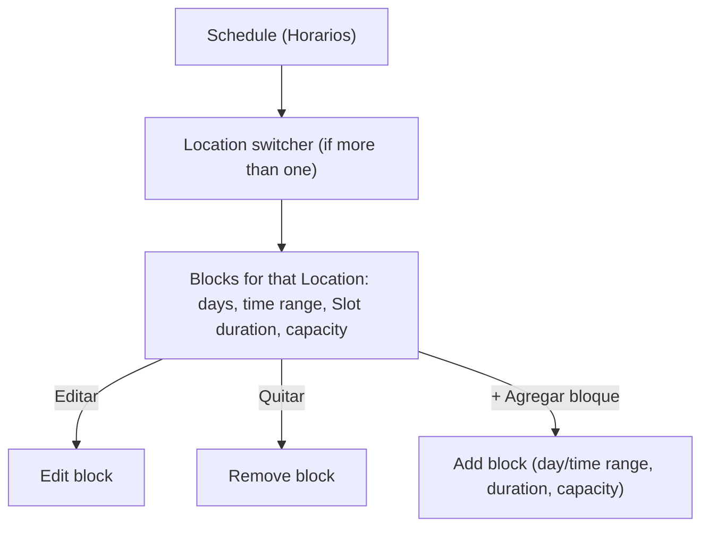
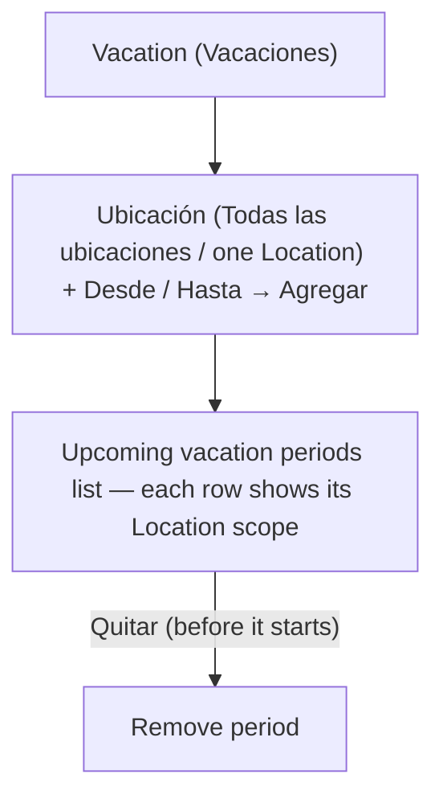
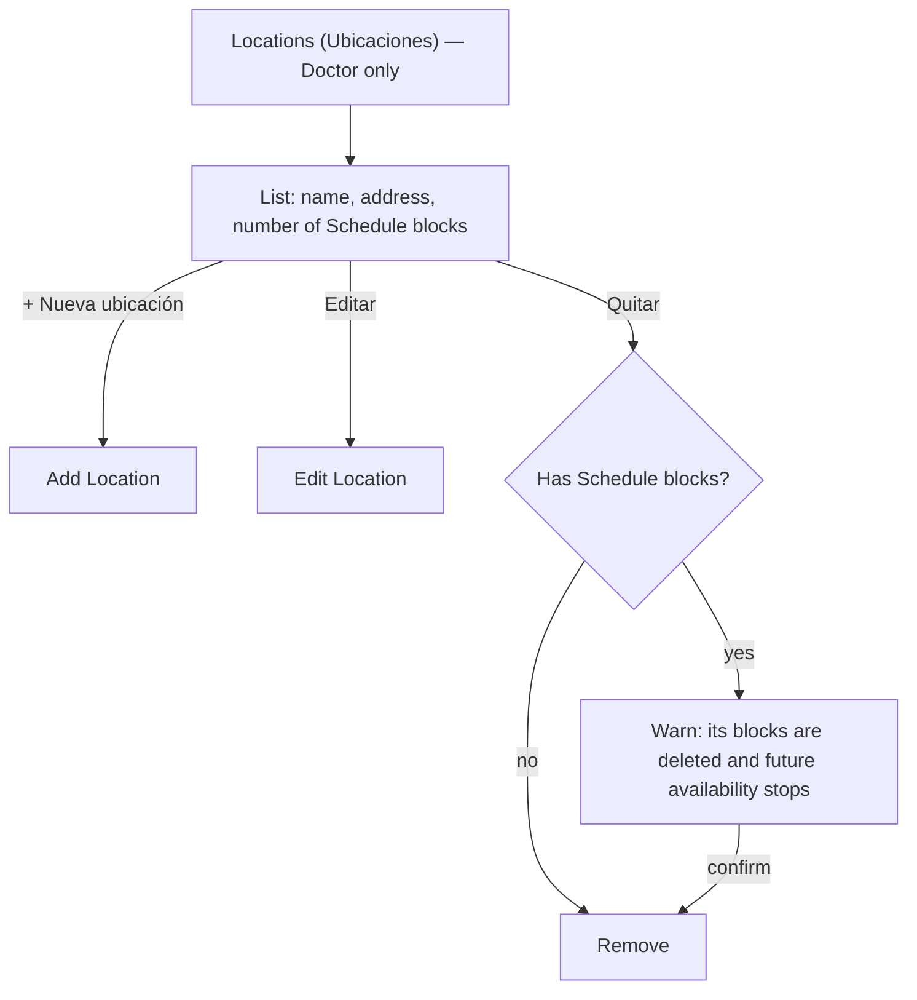
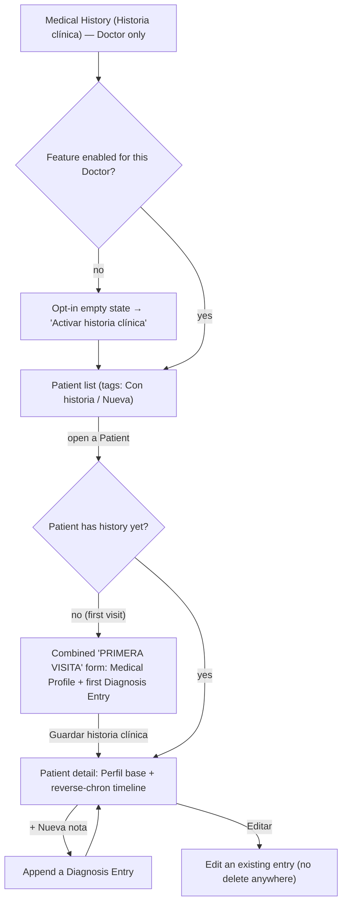
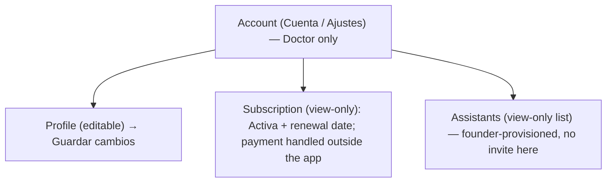

# Doctor/Assistant panel — flows

The login-gated surface shared by Doctors and their Assistants. Both roles use the
same shell, but a **Assistant has a structurally shorter navigation** and cannot reach
Locations, the Doctor's Account/Subscription, or Medical History
(`CONTEXT.md`: Assistant). Accounts are founder-provisioned
([ADR-0005](../adr/0005-concierge-doctor-onboarding.md),
[ADR-0013](../adr/0013-assistant-accounts-founder-provisioned.md)).

## 1. Login & role-based routing

No self-serve password reset — resets are administrator-driven (`CONTEXT.md`: Admin;
see [`admin.md`](admin.md) flow 3).

> The prototype always routes a Doctor to Onboarding for demo purposes; the product
> rule is **first login only**, then straight to Appointments on return.

## 2. Onboarding wizard (Doctor only, first login)

An Assistant never sees this. The Doctor fills in everything themselves — the concierge
step only created a bare, name-only account
([ADR-0005](../adr/0005-concierge-doctor-onboarding.md)).

- **Step 2** — add one or more Locations (name + address).
- **Step 3** — per-Location tabs; each Schedule block sets day range, time range, **Slot
  duration**, and **Slot capacity**; multiple blocks per Location
  ([ADR-0004](../adr/0004-schedule-per-location.md),
  [ADR-0009](../adr/0009-slots-have-capacity.md)).
- **Back** is hidden on step 1. Everything is editable later from the panel.

## 3. Navigation shell — Doctor vs Assistant

The doctor-only items are **absent from the DOM** for an Assistant (with matching route
guards), not merely disabled.

> Guard: if the session becomes an Assistant while on a doctor-only screen, it redirects
> to Appointments.

## 4. Appointments / queue (Citas)

Filterable by Day and Location. Staff can enter Appointments for patients who booked
off-platform, including **over a Slot's patient-facing capacity** as a deliberate
override ([ADR-0009](../adr/0009-slots-have-capacity.md)). Available to Doctor **and**
Assistant — an Assistant may mark attendance (`CONTEXT.md`: Assistant).

> Marking **Attended** is also the trigger for a Medical History Diagnosis Entry — but
> only when the **Doctor** does it and has opted in (see flow 9 and the Appointment
> lifecycle in [`domain-lifecycles.md`](domain-lifecycles.md)).

## 5. Day-before Confirmations (Confirmaciones)

Manual WhatsApp, never automated ([ADR-0003](../adr/0003-whatsapp-via-manual-links.md)).
The pending count drives the nav badge.

## 6. Schedule editor (Horarios)

Blocks are **per Location** ([ADR-0004](../adr/0004-schedule-per-location.md)).

## 7. Vacation editor (Vacaciones)

Marks a date range unavailable so no Slots are shown for it (`CONTEXT.md`: Vacation).
Scoped to one Location, or the whole practice at once (`locationId` nullable — null
means every Location).

## 8. Locations management (Doctor only)

The only screen where **removing** a Location matters, because it has Schedules tied to
it ([ADR-0004](../adr/0004-schedule-per-location.md)).

## 9. Medical History (Doctor only, opt-in, append-only)

Ships in v1 but opt-in ([ADR-0010](../adr/0010-medical-history-optional-in-v1.md)),
siloed per Doctor–Patient pair
([ADR-0011](../adr/0011-medical-history-siloed-per-doctor.md)). Entries can be edited but
**never deleted** — history only grows.

> The Medical Profile + first Diagnosis Entry are captured together the first time a
> Patient's Appointment is marked **Attended** (`CONTEXT.md`: Medical Profile). A
> Assistant can mark Attended but can never view or edit this screen.

## 10. Account settings (Doctor only)

Subscription is record-keeping only, no in-app billing
([ADR-0002](../adr/0002-no-in-app-payments.md)); Assistants are created by the founder,
not invited here ([ADR-0013](../adr/0013-assistant-accounts-founder-provisioned.md)).

---

**Sources**: `CONTEXT.md` (Doctor, Assistant, Onboarding, Schedule, Slot, Vacation,
Appointment, Confirmation, Medical History, Subscription); ADRs
[0002](../adr/0002-no-in-app-payments.md),
[0003](../adr/0003-whatsapp-via-manual-links.md),
[0004](../adr/0004-schedule-per-location.md),
[0005](../adr/0005-concierge-doctor-onboarding.md),
[0009](../adr/0009-slots-have-capacity.md),
[0010](../adr/0010-medical-history-optional-in-v1.md),
[0011](../adr/0011-medical-history-siloed-per-doctor.md),
[0013](../adr/0013-assistant-accounts-founder-provisioned.md); prototype
`design/Alivia Panel Prototype.dc.html`.
