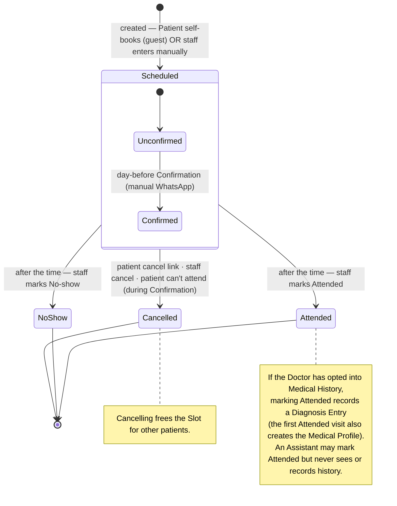
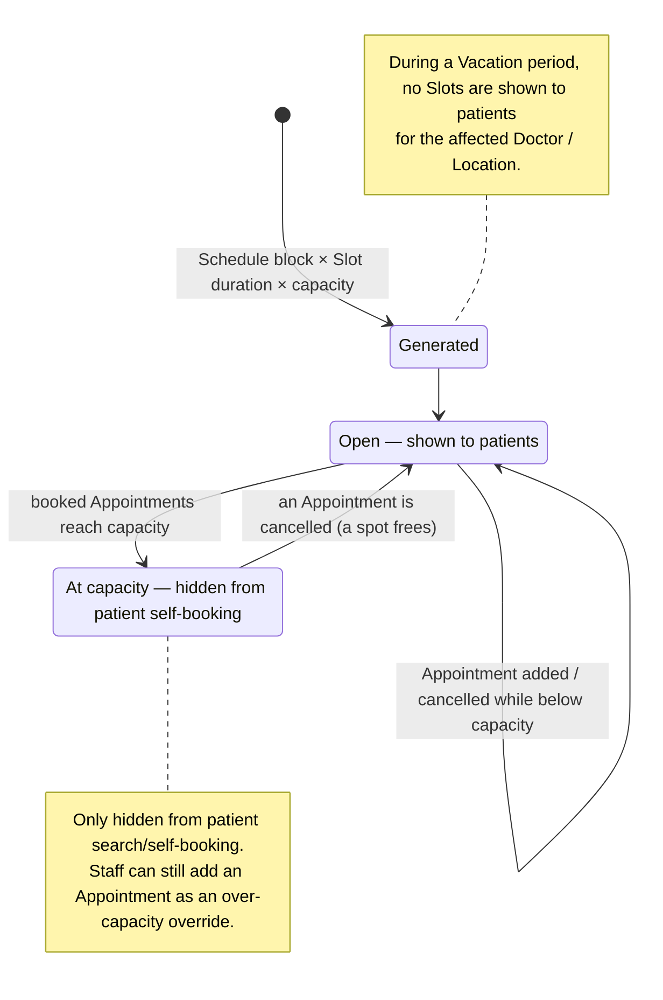
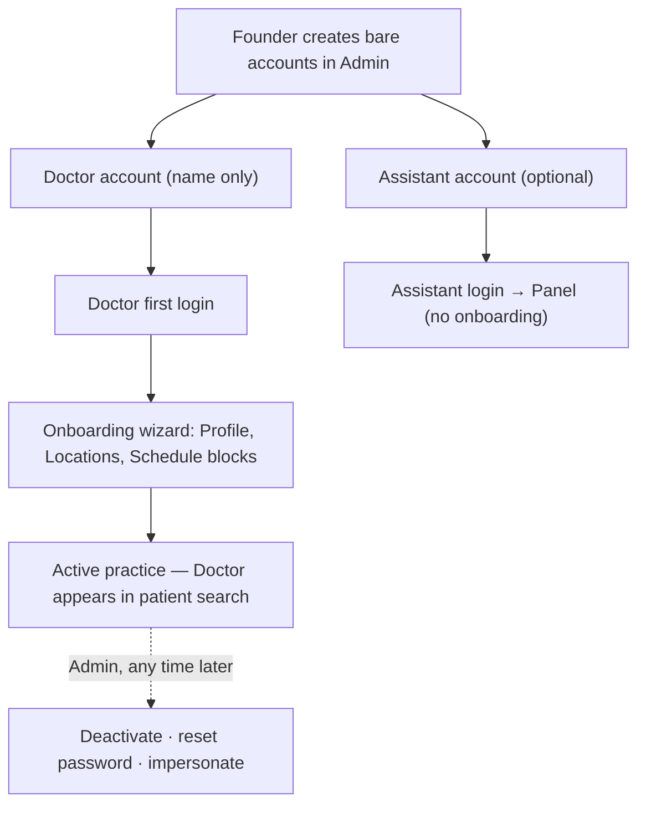
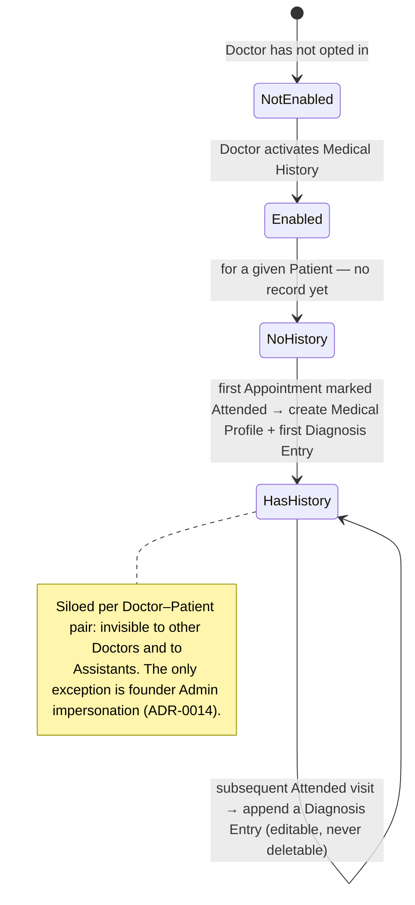

# Domain lifecycles — state machines

The state machines behind the entities, independent of any single screen. These are the
rules the schema and server logic must enforce; the UI flows in the other docs are ways
of driving these transitions.

## 1. Appointment lifecycle

An Appointment is created either by a Patient self-booking (guest) or entered by
staff for an off-platform patient — the latter may exceed a Slot's patient-facing
capacity ([ADR-0009](../adr/0009-slots-have-capacity.md)). The day-before **Confirmation**
checks *intent to attend* and is distinct from the final **Attended / No-show** outcome
recorded after the appointment time (`CONTEXT.md`: Appointment, Confirmation).

- **Confirmation** (Confirmed / Unconfirmed) is a sub-state of Scheduled, not a terminal
  state — it only reflects the day-before check
  ([ADR-0003](../adr/0003-whatsapp-via-manual-links.md)).
- **Attended, No-show, Cancelled** are final.

## 2. Slot capacity & availability

A Slot is generated from a Schedule block (per Location) and its duration/capacity
([ADR-0004](../adr/0004-schedule-per-location.md),
[ADR-0009](../adr/0009-slots-have-capacity.md)). Capacity is a **hard cap for patient
self-booking only** — staff can override.

## 3. Account provisioning → onboarding

Concierge account creation, then self-serve setup
([ADR-0005](../adr/0005-concierge-doctor-onboarding.md),
[ADR-0013](../adr/0013-assistant-accounts-founder-provisioned.md)). There is no public
doctor signup in v1.

## 4. Medical History (per Doctor–Patient pair)

Opt-in per Doctor ([ADR-0010](../adr/0010-medical-history-optional-in-v1.md)), siloed per
Doctor–Patient pair ([ADR-0011](../adr/0011-medical-history-siloed-per-doctor.md)),
append-only. The Medical Profile and first Diagnosis Entry are created together on the
first Attended visit (`CONTEXT.md`: Medical Profile, Diagnosis Entry).

---

**Sources**: `CONTEXT.md` (Slot, Appointment, Confirmation, Vacation, Onboarding,
Medical History, Medical Profile, Diagnosis Entry, Assistant, Admin); ADRs
[0003](../adr/0003-whatsapp-via-manual-links.md),
[0004](../adr/0004-schedule-per-location.md),
[0005](../adr/0005-concierge-doctor-onboarding.md),
[0009](../adr/0009-slots-have-capacity.md),
[0010](../adr/0010-medical-history-optional-in-v1.md),
[0011](../adr/0011-medical-history-siloed-per-doctor.md),
[0013](../adr/0013-assistant-accounts-founder-provisioned.md),
[0014](../adr/0014-admin-impersonation-full-access.md).
