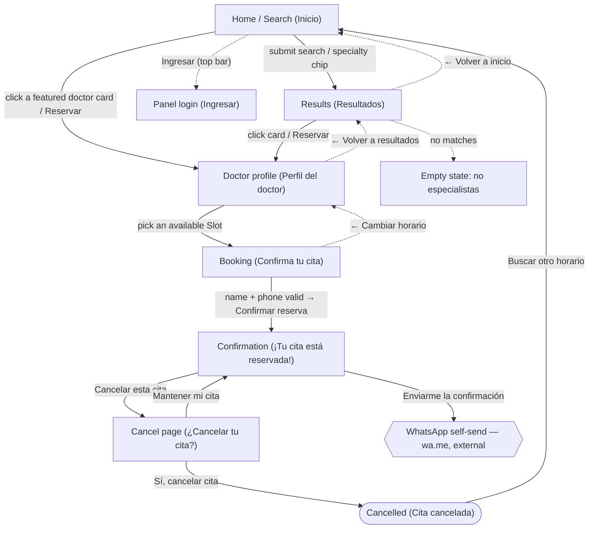
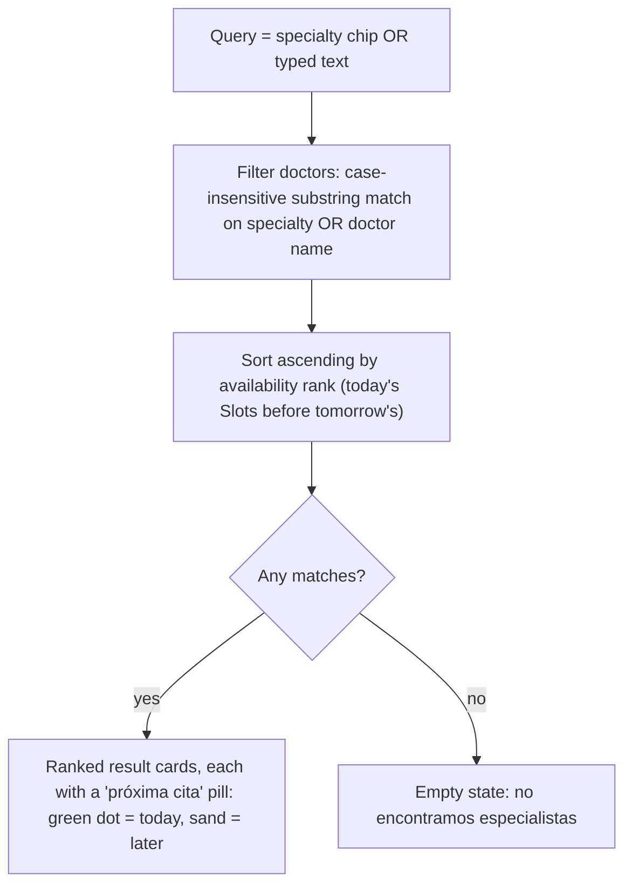
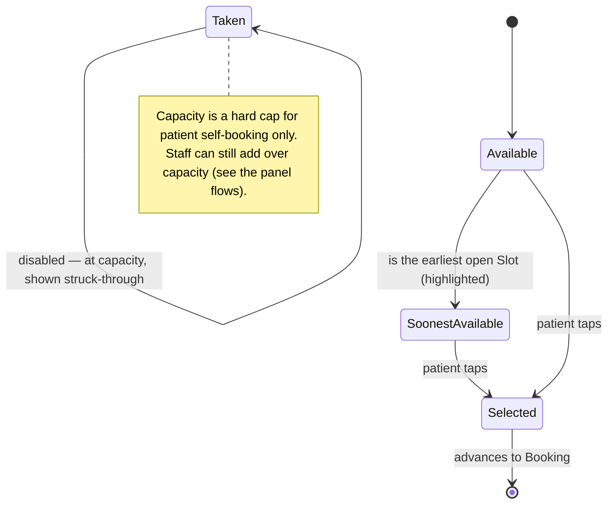
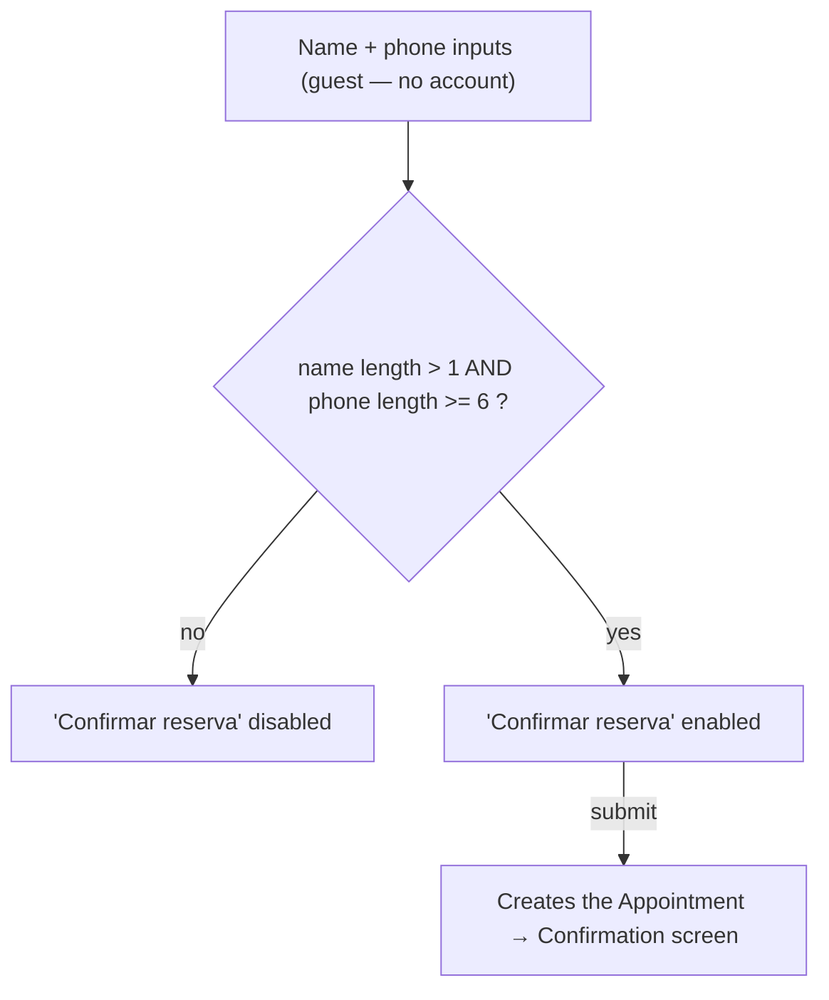

# Patient site — flows

The public, no-login surface. A Patient books as a guest: identified by name + phone,
never an account ([ADR-0006](../adr/0006-guest-booking-no-patient-accounts.md)). The
core differentiator is that doctors are ranked by **soonest available Slot**, not by
proximity ([ADR-0008](../adr/0008-availability-first-search-no-location-filter.md)).

## 1. Booking loop (screen navigation)

**Notes**

- The Home page lists the top-3 doctors by availability. Clicking a featured card (or
  its **Reservar**) jumps straight to that Doctor's profile, skipping Results.
- In production the **Cancel page is reached from the cancel link inside the Patient's
  WhatsApp confirmation message** — no login needed. The "Cancelar esta cita" button on
  the Confirmation screen is the prototype's shortcut to that same page.
- The home has two visual variants (identity-first `1a`, time-block-first `1b`); they
  differ only in presentation, not navigation.

## 2. Search & availability ranking

Patients search by specialty only — no location/zone filter
([ADR-0008](../adr/0008-availability-first-search-no-location-filter.md)).

## 3. Slot selection (state of a Slot button on the profile)

A Patient sees only whether a time is **open or closed** — the Slot's queue capacity is
hidden ([ADR-0009](../adr/0009-slots-have-capacity.md)). A "taken" Slot is one that has
reached capacity for patient self-booking.

## 4. Booking form validation

---

**Sources**: `CONTEXT.md` (Patient, Slot, Appointment, Confirmation),
[ADR-0006](../adr/0006-guest-booking-no-patient-accounts.md),
[ADR-0008](../adr/0008-availability-first-search-no-location-filter.md),
[ADR-0009](../adr/0009-slots-have-capacity.md),
[ADR-0003](../adr/0003-whatsapp-via-manual-links.md); prototype `design/Alivia Prototype.dc.html`.
